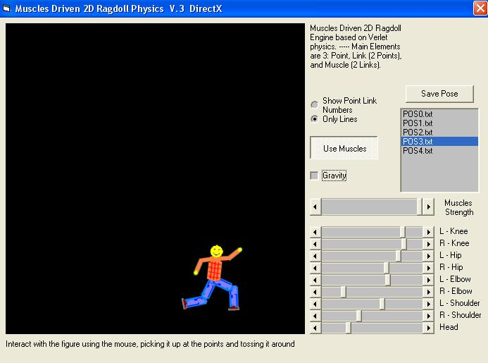



## Muscles Driven 2D Ragdoll Physics \-  V\.3\.1  \[DirectX\]

### Description

Now with DIRECTX GRAPHICS!!! 

----

2D Engine based on verlet physics. 

----

Main Elements are 3: Point, Link (2 Points), and Muscle (2 Links)

----

The muscle is defined as two links (limbs) , the angle that should occur between them, and the muscle strength. 

----

You Can manually change Muscles Values with Scrollbars. 

----

Can interact with figure with the mouse. 

----

[ V.3 ] Added Gravity On/Off. Added Save/Load Pose. 

----

[ V3.1 ] Added Muscles Speed Limiter (It Deny too Fast Muscles movement, so it's good for Stability), and Exit button 

----

Suggestions for the Physics will be very appreciated. 

----

----

To Run must have dx8vb.dll 

----

 
### More Info
 

             |
---                |---
**Submitted On**   |2009-05-15 02:15:40
**By**             |[reexre](https://github.com/Planet-Source-Code/PSCIndex/blob/master/ByAuthor/reexre.md)
**Level**          |Intermediate
**User Rating**    |5.0 (25 globes from 5 users)
**Compatibility**  |VB 6\.0
**Category**       |[Games](https://github.com/Planet-Source-Code/PSCIndex/blob/master/ByCategory/games__1-38.md)
**World**          |[Visual Basic](https://github.com/Planet-Source-Code/PSCIndex/blob/master/ByWorld/visual-basic.md)
**Archive File**   |[Muscles\_Dr2152735192009\.zip](https://github.com/Planet-Source-Code/reexre-muscles-driven-2d-ragdoll-physics-v-3-1-directx__1-72083/archive/master.zip)

